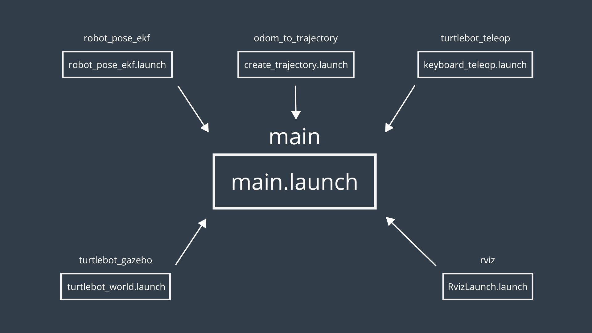
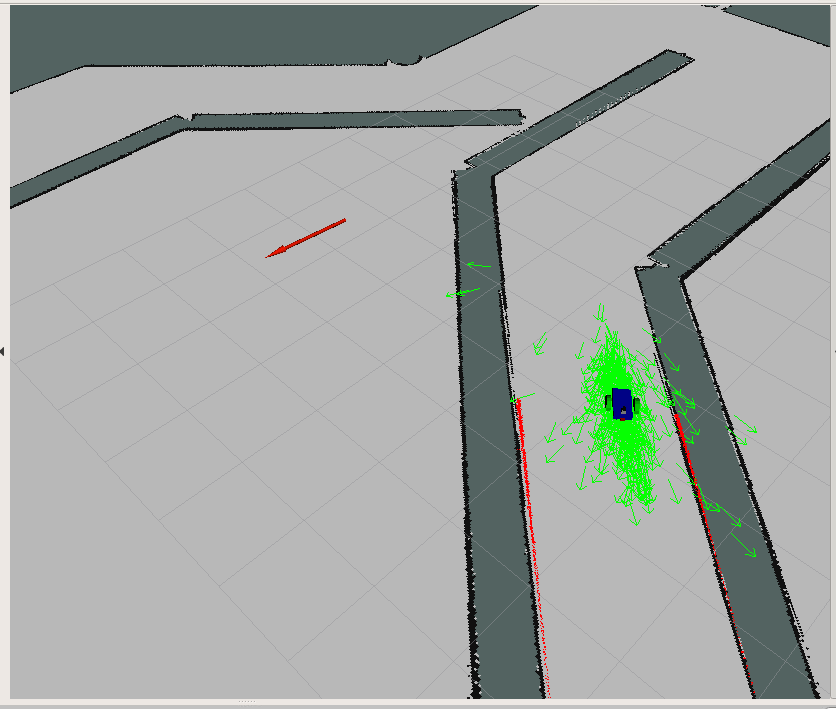
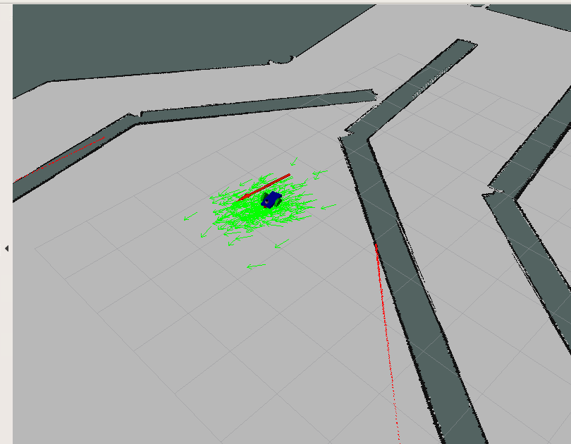

# Location

## Part I
Use EKF filter to do the location for Turtlebot robot.

Here, you will apply five different ros packages.
1. turtlebot_gazebo
2. robot_pose_ekf
3. odom_to_trajectory
4. turtlebot_teleop
5. rviz 

## Part II

