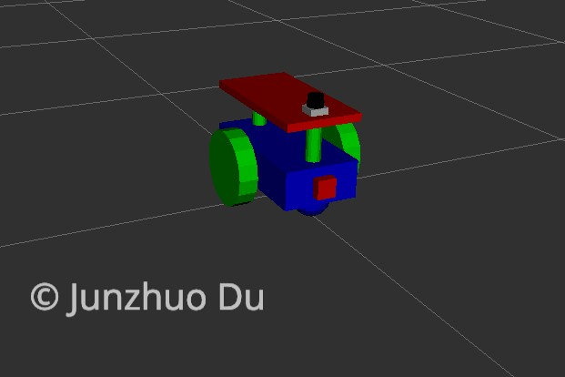

# Location

## Part I 
```
/Kalman_Filters
```
Use EKF filter to do the location for Turtlebot robot.

Here, you will apply five different ros packages.
1. turtlebot_gazebo
2. robot_pose_ekf
3. odom_to_trajectory
4. turtlebot_teleop
5. rviz 


## Part II 
```
/udacity_bot
```
1. Building a mobile robot for simulated tasks.
2. Creating a ROS package that launches a custom robot model in a Gazebo world and utilizes packages like AMCL and the Navigation Stack.
3. Exploring, adding, and tuning specific parameters corresponding to each package to achieve the best possible localization results.




