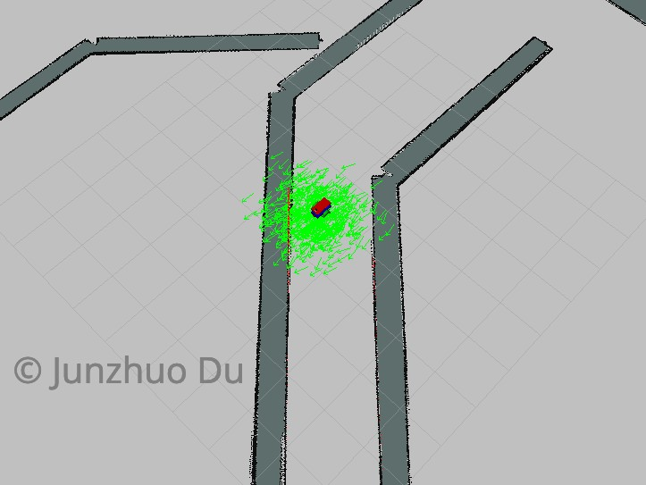
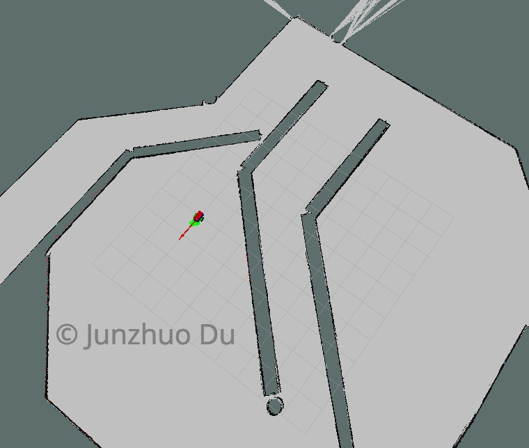

### Steps to Launch the Simulation

#### Step 1 Install packages
```sh
$ sudo apt-get install ros-kinetic-navigation
$ sudo apt-get install ros-kinetic-map-server
$ sudo apt-get install ros-kinetic-move-base
$ rospack profile
$ sudo apt-get install ros-kinetic-amcl
```

#### Step 2 Perform a System Update/Upgrade
```sh
$ apt-get update
$ apt-get upgrade -y
```

#### Step 3 Clone the Package in src
```sh
$ cd /home/../catkin_ws/src
$ git clone https://github.com/Junzhuodu/Locatization/edit/master/udacity_bot
```

#### Step 4 Build the Packages
```sh
$ catkin_make
$ source devel/setup.bash
```

#### Step 5 Launch the main file
```sh
$ roslaunch udacity_bot udacity_world.launch
$ roslaunch udacity_bot amcl.launch
rosrun udacity_bot navigation_goal
```
Now, you should see Gazebo and rviz launching. Please note that Gazebo might take up to 3 min to launch! 


### End Result
In the terminal, use the keyboard commands(u-i-o-j-k-l-m-,-.) and drive the robot around. The `red` trajectory represents the `Odom path` whereas the `green` trajectory represents the `EKF path`.






